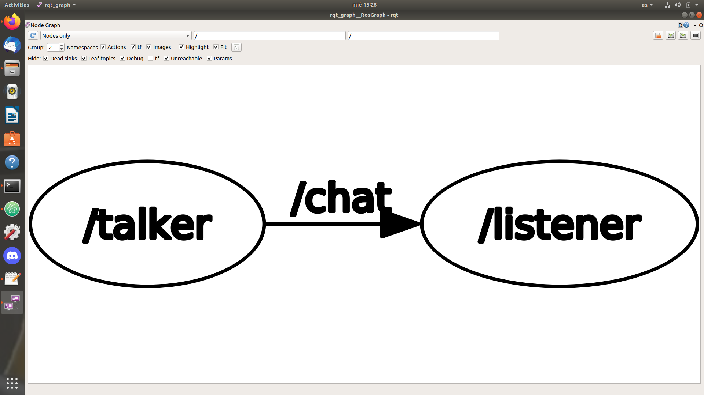
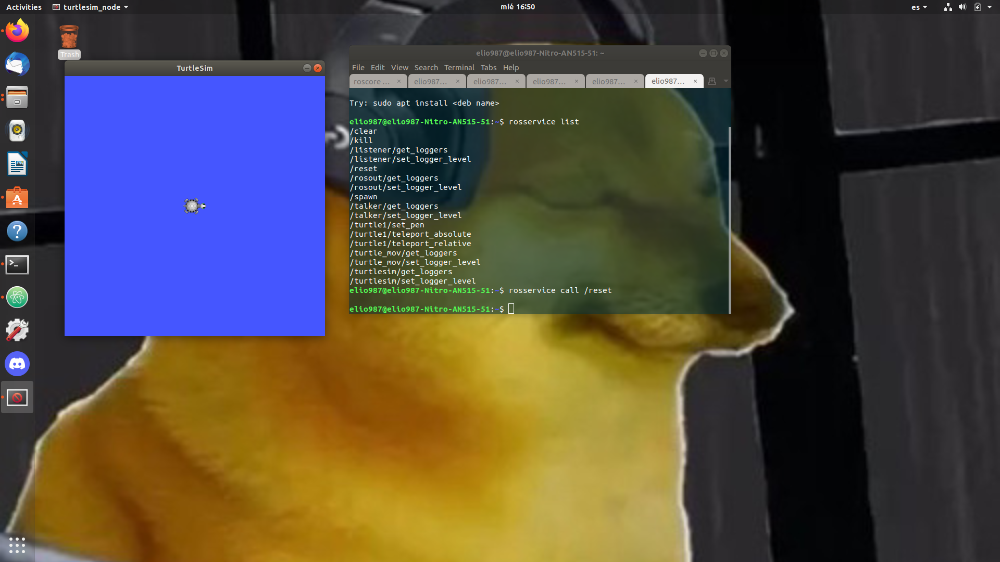
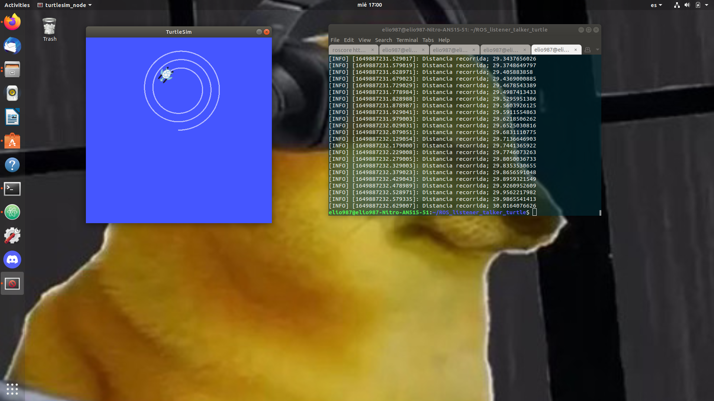

# ROS_listener_talker_turtle
Proyecto en el que se usa ROS melodic en ubuntu 18.04, para poder hacer un ejercicioo basico de comunicar dos nodos, además de controlar la tortuga de ROS, todo por medio de Python.
- Al hacer el git clone del repositorio habre una terminal y ve hasta la carpeta llamcada ROS_listener_talker_turtle en ingresa este comando:
```
catkin_make
```
- Después de hacer el git clone del repositorio, haber guardado el workspace y compilarlo, recuerda cada vez que habras una nueva terminal o pestaña de esta misma ingresar este comando para actulizar las variables del entorno de tu workspace, siempre a la altura de la carpeta de tu workspace:
```
source devel/setup.bash
```

- Para poder correr el proyecto en la terminal inicia el roscore.
```
roscore
```
## Talker - Listener
- Localidad de los archivos talker y listener en el proyecto
```
/ROS_listener_talker_turtle/src/talker_listener/src/
/ROS_listener_talker_turtle/src/talker_listener/src/talker.py
/ROS_listener_talker_turtle/src/talker_listener/src/listener.py
```
- Para poder corre el talker y el listener habre otra pestaña de la terminal e ingresa:
```
rosrun talker_listener talker
```
- Luego en otra pestañan ingresa
```
rosrun talker_listener listener
```
- Si todo esta corriendo bien debes ver mensaje de Hello World en la pestaña donde corriste el listener.
- Para verificar el funcionamiento al ingresar el digueinte comando en una nuev pestaña de la terminal:
```
rqt_graph
```
Se debe ver lo siguiente:

## Trutle espiral
- Localidad del archivo para poder mover la tortuga
```
/ROS_listener_talker_turtle/src/turtle_mov/src/turtle_mov.py
```
```
/ROS_listener_talker_turtle/src/talker_listener/src/
```
- Para poder correr la tortuga en espiral, ingresa el sigueinte comando en una nueva terminal:
```
rosrun turtlesim turtlesim_node
```
- Al correr esto se deberia ver algo como esto:

- Después en una nueva terminal ingresa el sigueinte comando para poder correr el codigo que hicimos:
```
rosrun turtle_mov turtle_mov.py
```
- Al correr esto la tortuga al terminar el programa debe tener este movimiento:

- Para poder a poner a la tortuga en su posicion inicial ingresa en una nueva terminal:
```
rosservice call /reset
```
## Nota importante:
Cada vez que habras un terminal ingresa el sigueinte comando a la altura de la carpeta de tu worspace de ROS:
```
source devel/setup.bash
```
